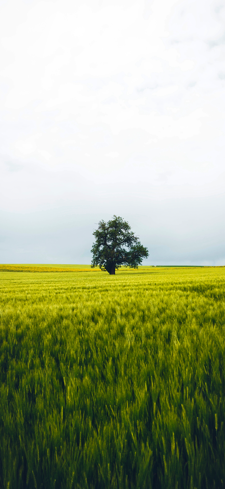

  <a href="./README.zh-CN.md">简体中文 🇨🇳</a> |
  <a href="./README.md">English 🇺🇸</a>

# Photo Rasteriator

👉 [Click here to try it online](https://kujicheng.github.io/Vertical-raster-transform/)

Photo Rasteriator is a web-based tool that allows users to upload an image, adjust various parameters, and generate a rasterized version of the image using Python running on the browser via Pyodide. The tool is built using SvelteKit, providing a responsive and user-friendly interface.

---
## Features

- **Upload Images**: Users can upload `.png` or `.jpg` images for processing.
- **Parameter Adjustment**: Customize rasterization using adjustable parameters:
  - **Slice Count**: Adjust the number of slices in the rasterization (5-100).
  - **Blur Radius**: Control the level of Gaussian blur (0-100).
  - **Highlight Intensity**: Adjust the intensity of highlights (0.00-1.00).
  - **Shadow Intensity**: Adjust the intensity of shadows (0.00-1.00).
- **Real-time Feedback**: Parameter values are dynamically updated as sliders are adjusted.
- **Language Toggle**: Switch between English and Chinese for the interface.
- **Download Result**: Download the processed image with the original filename plus a `_rasterization` suffix.
- **Loading Indicator**: Displays a loading animation while the image is being processed.

## Usage

1. **Upload an Image**:
   - Click the **"Choose Image"** button located below the left rectangle.
   - Select an image file in `.png` or `.jpg` format.
   - The uploaded image will appear in the left rectangle.

2. **Adjust Parameters**:
   - Use the sliders in the **"Parameter Adjustment"** section (center rectangle) to modify the following:
     - **Slice Count**: Number of slices for rasterization (range: 5-100).
     - **Blur Radius**: Intensity of Gaussian blur (range: 0-100).
     - **Highlight Intensity**: Intensity of highlights (range: 0.00-1.00).
     - **Shadow Intensity**: Intensity of shadows (range: 0.00-1.00).

3. **Process the Image**:
   - Click the **"Convert"** button located below the parameter sliders.
   - A loading animation will appear while the image is being processed.

4. **Download the Result**:
   - Once processing is complete, click the **"Download"** button below the right rectangle.
   - The rasterized image will be saved in the same format as the original image, with a filename appended with `_ra` (e.g., `original_ra.png`).

5. **Toggle Language**:
   - Use the toggle switch in the top-right corner to switch between English and Chinese interface languages.
   - The labels, buttons, and messages will update automatically based on the selected language.

## Example Input and Output
Here is a comparison of the input and output images:

<table> <tr> <td><strong>Original Image</strong></td> <td><strong>Processed Image</strong></td> </tr> <tr> <td></td> <td></td> </tr> </table>