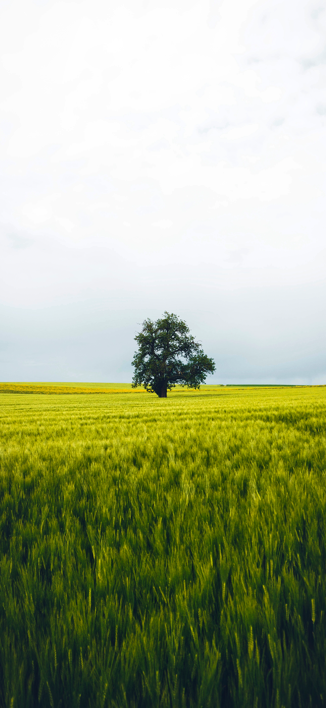
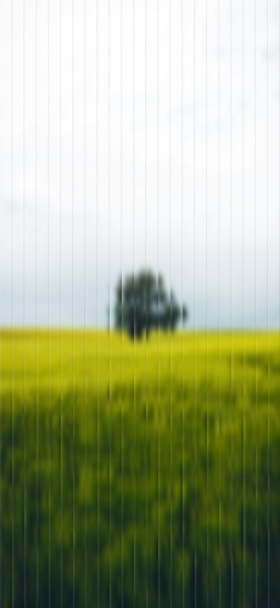

  <a href="./README.zh-CN.md">简体中文 🇨🇳</a> |
  <a href="./README.md">English 🇺🇸</a>

# 光栅壁纸生成器

**光栅壁纸生**成器是一个基于网页的工具，用户可以上传图片、调整多种参数，并通过运行在浏览器中的 Pyodide 执行 Python 脚本，生成光栅化后的图像。该工具使用 SvelteKit 构建，提供了响应式且易于使用的界面。

---

## 功能特点

- **上传图片**：用户可以上传 `.png` 或 `.jpg` 格式的图片进行处理。
- **参数调节**：通过可调参数自定义光栅化效果：
  - **切片数量**：调节光栅切片的数量（范围 5-100）。
  - **模糊半径**：控制高斯模糊的程度（范围 0-100）。
  - **高光强度**：调节高光的亮度强度（范围 0.00-1.00）。
  - **阴影强度**：调节阴影的深度强度（范围 0.00-1.00）。
- **实时反馈**：滑动条调整参数时，数值会动态更新。
- **语言切换**：界面支持中英文切换。
- **结果下载**：可下载处理后的图片，文件名在原名基础上添加 `_rasterization` 后缀。
- **加载指示器**：图片处理过程中会显示加载动画。

## 使用说明

1. **上传图片**：
   - 点击左侧矩形下方的 **“选择图片”** 按钮。
   - 选择一个 `.png` 或 `.jpg` 格式的图片文件。
   - 上传的图片将显示在左侧矩形区域中。

2. **调整参数**：
   - 在中间矩形区域的 **“参数调整”** 区块中使用滑动条修改以下内容：
     - **切片数量**：控制光栅切片的数量（范围：5-100）。
     - **模糊半径**：控制高斯模糊的强度（范围：0-100）。
     - **高光强度**：调整高光的亮度（范围：0.00-1.00）。
     - **阴影强度**：调整阴影的深度（范围：0.00-1.00）。

3. **处理图片**：
   - 点击参数滑块下方的 **“转换”** 按钮。
   - 图片处理期间将显示加载动画。

4. **下载结果**：
   - 处理完成后，点击右侧矩形下方的 **“下载”** 按钮。
   - 光栅化后的图片将以与原图相同的格式保存，文件名在原名后添加 `_ra` 后缀（例如：`original_ra.png`）。

5. **切换语言**：
   - 使用右上角的语言切换按钮在中文和英文界面之间切换。
   - 标签、按钮和提示信息将根据所选语言自动更新。

## 示例输入与输出

以下是原始图像与处理后图像的对比：

<table>
  <tr>
    <td><strong>原始图像</strong></td>
    <td><strong>处理后图像</strong></td>
  </tr>
  <tr>
    <td></td>
    <td></td>
  </tr>
</table>
